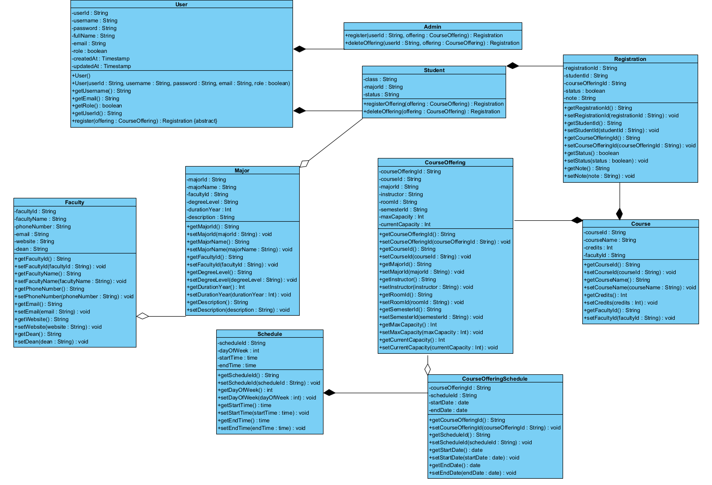

# Hệ thống đăng kí tín chỉ

[](https://github.com/HungNguyenBa1811/java-oop-ptit/blob/main/LICENSE)

# Description
Một dự án Java đơn giản để quản lý việc đăng kí tín chỉ của sinh viên, được xây dựng dựa trên cấu trúc MVC.

## Mục lục

- [Giới thiệu](#giới-thiệu)
- [Tính năng](#tính-năng)
- [Công nghệ sử dụng](#công-nghệ-sử-dụng)
- [Cấu trúc dự án](#cấu-trúc-dự-án)
- [Cài đặt](#cài-đặt)
- [Sử dụng](#sử-dụng)
- [Đóng góp & Phân công công việc](#đóng-góp--phân-công-công-việc)
- [Giấy phép](#giấy-phép)

## Giới thiệu

Đây là một dự án được phát triển nhằm mục đích học tập và thực hành các khái niệm về lập trình hướng đối tượng (OOP) trong Java, cũng như áp dụng mô hình kiến trúc Model-View-Controller (MVC). Hệ thống cho phép sinh viên đăng kí và quản lý các môn học của mình.

# System Features – Credit Registration Management

## 1. Student Module

### Credit Registration
Sinh viên đăng nhập và tự đăng ký lớp học phần (`course_offering`).

**Ràng buộc:**
- Không được đăng ký **trùng môn học** (mỗi sinh viên chỉ chọn một lớp học phần cho cùng một môn).
- Không được đăng ký **trùng lịch học**, tức là không được chọn 2 lớp mà có giao nhau về:
  - `day_of_week` (thứ trong tuần),
  - `start_time–end_time` (tiết/giờ học),
  - khoảng thời gian `start_date–end_date`.
- Không được đăng ký lớp đã đầy.

👉 Hệ thống kiểm tra các ràng buộc này khi sinh viên đăng ký. Nếu vi phạm → từ chối.

### Personal Information
Sinh viên có thể xem thông tin cá nhân (họ tên, lớp, ngành, khoa) được lưu trong hệ thống.

### Class Schedule
Sinh viên có thể xem lịch học cố định theo tuần từ `course_offerings_schedule` của các lớp học phần đã đăng ký.  
Thông tin hiển thị: **ngày bắt đầu – kết thúc, thứ trong tuần, giờ học**.

---

## 2. Admin Module

### Registration Management
Quản lý toàn bộ dữ liệu đăng ký tín chỉ.  
**Chức năng:**
- Xem danh sách đăng ký của tất cả sinh viên.
- Sửa thông tin đăng ký (chuyển lớp, cập nhật ghi chú).
- Xóa đăng ký (hủy môn học, chỉnh sửa sai sót).

### Monitoring & Control
- Theo dõi sĩ số từng lớp học phần, đảm bảo không vượt `max_capacity`.
- Có thể tra cứu lịch học (`course_offerings_schedule`) để kiểm soát trùng lịch khi cần.

---

## 3. Student Registration Screen

Khi sinh viên truy cập vào màn hình đăng ký tín chỉ, hệ thống hiển thị:

- **Danh sách lớp học phần (course_offerings)** khả dụng trong kỳ hiện tại, gồm các thông tin:
  - Tên môn học
  - Mã lớp học phần (`course_offering_id`)
  - Giảng viên phụ trách
  - Số tín chỉ
  - Sĩ số hiện tại / Sĩ số tối đa
  - Thông tin lịch học từ `course_offerings_schedule` (thứ, giờ học, ngày bắt đầu, ngày kết thúc)

- **Trạng thái đăng ký** cho từng lớp:
  - **Nút "Đăng ký"** (enable) → nếu lớp còn chỗ trống và không vi phạm ràng buộc.
  - **Nút "Đăng ký"** (disable, màu xám) → nếu lớp:
    - Đã được sinh viên đăng ký trước đó,
    - Trùng môn học đã đăng ký,
    - Trùng lịch học với lớp khác,
    - Hoặc đã đầy sĩ số (`max_capacity`).
  - Khi hover vào nút disable → hiển thị tooltip thông báo lý do (ví dụ: *“Môn học đã được đăng ký”*, *“Lịch học trùng với lớp XYZ”*, *“Lớp đã đầy”*).

- **Bảng đăng ký cá nhân**:
  - Hiển thị danh sách các lớp học phần sinh viên đã đăng ký trong kỳ.
  - Có thể hủy/xóa đăng ký trước hạn quy định.

**Luồng thao tác chính:**
1. Sinh viên chọn lớp học phần từ danh sách.
2. Hệ thống kiểm tra ràng buộc (trùng môn, trùng lịch, sĩ số).
3. Nếu hợp lệ → lưu vào `registrations` và cập nhật sĩ số `course_offerings`.
4. Nếu không hợp lệ → hiển thị thông báo lỗi, không cho đăng ký.


## 4. Database Notes

**Bảng liên quan:**
- `users`: thông tin chung (username, password, role).
- `students`: thông tin riêng cho sinh viên.
- `courses`: thông tin môn học.
- `course_offerings`: lớp học phần mở theo kỳ/năm học.
- `course_offerings_schedule`: lịch học cố định (ngày bắt đầu/kết thúc, thứ, giờ học).
- `registrations`: lưu đăng ký của sinh viên.

**ERD:** [View Diagram](https://dbdiagram.io/d/erd-oop-db-68d0c6b07c85fb9961bc7bee)

## Công nghệ sử dụng

- **Ngôn ngữ:** Java (JDK 8+)
- **UI Framework:** JavaFX - Giao diện desktop hiện đại
- **Kiến trúc:** Model-View-Controller (MVC) với Service Layer
- **Cơ sở dữ liệu:** MySQL 5.7+
- **JDBC Driver:** MySQL Connector/J
- **Design Patterns:** 
  - Repository Pattern
  - Singleton Pattern (Database Connection)
  - Generic DAO Pattern
  - MVC Pattern với JavaFX

## Cấu trúc dự án

Dự án được tổ chức theo mô hình MVC với JavaFX:

- **Model:** Chứa các lớp đại diện cho dữ liệu của ứng dụng (Entity classes: User, Student, Admin, Course, CourseOffering, Registration, etc.)
- **View:** JavaFX FXML files và UI components - Giao diện người dùng desktop
- **Controller:** Xử lý các yêu cầu từ người dùng, tương tác với `Model` thông qua Service layer và cập nhật `View`
- **DAO:** Data Access Objects - Tương tác trực tiếp với database
- **Service:** Business Logic Layer - Xử lý validation và ràng buộc nghiệp vụ

Class Diagram:
<div align="center">

</div>

Cấu trúc thư mục:
```
java-oop-ptit/
├── docs/                                    # Tài liệu dự án
│   ├── ClassDiagram.png                     # Sơ đồ class
│   ├── CourseOfferingRegistration.vpp       # File Visual Paradigm
│   ├── database_schema.sql                  # Schema database
│   ├── dbml.md                              # DBML specification
│   └── PROJECT_STRUCTURE.md                 # Chi tiết cấu trúc
├── lib/                                     # Thư viện external (JDBC driver)
├── src/
│   ├── main/
│   │   ├── java/
│   │   │   ├── model/                       # Entity classes (POJO)
│   │   │   │   ├── User.java
│   │   │   │   ├── Student.java
│   │   │   │   ├── Admin.java
│   │   │   │   ├── Course.java
│   │   │   │   ├── CourseOffering.java
│   │   │   │   ├── Registration.java
│   │   │   │   ├── Major.java
│   │   │   │   ├── Faculty.java
│   │   │   │   ├── Schedule.java
│   │   │   │   ├── CourseOfferingSchedule.java
│   │   │   │   ├── Semester.java
│   │   │   │   └── Room.java
│   │   │   ├── dao/                         # Data Access Objects
│   │   │   │   ├── BaseDAO.java             # Generic DAO
│   │   │   │   ├── UserDAO.java
│   │   │   │   ├── StudentDAO.java
│   │   │   │   ├── CourseDAO.java
│   │   │   │   ├── CourseOfferingDAO.java
│   │   │   │   └── RegistrationDAO.java
│   │   │   ├── service/                     # Business Logic
│   │   │   │   ├── UserService.java
│   │   │   │   ├── StudentService.java
│   │   │   │   ├── CourseService.java
│   │   │   │   ├── CourseOfferingService.java
│   │   │   │   └── RegistrationService.java
│   │   │   ├── controller/                  # Request Handlers
│   │   │   │   ├── UserController.java
│   │   │   │   ├── StudentController.java
│   │   │   │   ├── CourseController.java
│   │   │   │   ├── CourseOfferingController.java
│   │   │   │   └── RegistrationController.java
│   │   │   ├── util/                        # Utilities
│   │   │   │   └── DatabaseConnection.java
│   │   │   └── exception/                   # Custom Exceptions
│   │   └── resources/
│   │       ├── config/
│   │       │   └── database.properties      # DB configuration
│   │       └── sql/
│   │           ├── schema.sql               # Create tables
│   │           └── sample_data.sql          # Test data
│   └── test/
│       └── java/                            # Unit tests
├── .gitignore
├── LICENSE
├── README.md
└── README_PROJECT.md                        # Hướng dẫn chi tiết
```

Sơ đồ kiến trúc:
```ascii
┌─────────────┐       ┌──────────────┐       ┌──────────────┐       ┌─────────┐       ┌──────────┐
│  Controller │ ----> │   Service    │ ----> │     DAO      │ ----> │  Model  │ ----> │ Database │
│  (Handler)  │ <---- │  (Business)  │ <---- │ (Repository) │ <---- │ (POJO)  │ <---- │  MySQL   │
└─────────────┘       └──────────────┘       └──────────────┘       └─────────┘       └──────────┘
      ↑                                                                                       
      │                                                                                       
  User Request                                                                               
```

**Flow xử lý:**
1. **Controller** nhận request từ user
2. **Service** xử lý business logic (validation, ràng buộc)
3. **DAO** thực hiện CRUD operations với database
4. **Model** là entity đại diện cho data
5. Kết quả trả về theo chiều ngược lại

## Cài đặt

### 1. Yêu cầu hệ thống
- **Java JDK 11 trở lên** (JavaFX yêu cầu JDK 11+)
- **JavaFX SDK 11+** (nếu không dùng module system)
- **MySQL Server 5.7+**
- **IDE:** IntelliJ IDEA (recommended) / Eclipse / VS Code (với Extension Pack for Java)
- **MySQL Connector/J** (JDBC Driver)
- **Scene Builder** (optional - để design FXML trực quan)

### 2. Clone repository
```bash
git clone https://github.com/HungNguyenBa1811/java-oop-ptit.git
cd java-oop-ptit
```

### 3. Cài đặt MySQL Database

#### Bước 1: Tạo database
```bash
mysql -u root -p
```

```sql
CREATE DATABASE course_registration_db CHARACTER SET utf8mb4 COLLATE utf8mb4_unicode_ci;
USE course_registration_db;
```

#### Bước 2: Import schema và sample data
```bash
# Import schema
mysql -u root -p course_registration_db < src/main/resources/sql/schema.sql

# Import sample data (optional)
mysql -u root -p course_registration_db < src/main/resources/sql/sample_data.sql
```

### 4. Cấu hình Database Connection

Chỉnh sửa file `src/main/resources/config/database.properties`:

```properties
db.url=jdbc:mysql://localhost:3306/course_registration_db
db.username=root
db.password=your_password_here
db.driver=com.mysql.cj.jdbc.Driver
```

### 5. Cài đặt JavaFX

#### Cách 1: Sử dụng IntelliJ IDEA (Recommended)
IntelliJ IDEA đã tích hợp sẵn JavaFX, chỉ cần:
1. Mở project trong IntelliJ
2. File → Project Structure → Libraries → Add JavaFX SDK
3. Hoặc dùng Maven/Gradle dependencies (xem bên dưới)

#### Cách 2: Tải JavaFX SDK thủ công
1. Tải JavaFX SDK từ: https://gluonhq.com/products/javafx/
2. Giải nén vào thư mục `lib/javafx-sdk-xx/`
3. Add VM options khi chạy:
```
--module-path "lib/javafx-sdk-xx/lib" --add-modules javafx.controls,javafx.fxml
```

### 6. Thêm JDBC Driver (nếu không dùng Maven)

1. Tải driver từ: https://dev.mysql.com/downloads/connector/j/
2. Chọn **Platform Independent**
3. Giải nén và copy file `mysql-connector-java-x.x.xx.jar` vào thư mục `lib/`

### 7. Biên dịch và chạy

#### IntelliJ IDEA (Recommended cho JavaFX)
1. Mở project
2. File → Project Structure → Libraries:
   - Add JavaFX SDK
   - Add JDBC driver
3. Run → Edit Configurations → VM options (nếu cần):
   ```
   --module-path "path/to/javafx-sdk/lib" --add-modules javafx.controls,javafx.fxml
   ```
4. Chạy `Main.java`

#### VS Code
1. Cài đặt **Extension Pack for Java**
2. Cài đặt extension **JavaFX Support**
3. Mở folder `java-oop-ptit`
4. Cấu hình `launch.json` với VM arguments cho JavaFX
5. Nhấn `F5` để chạy

#### Command Line với JavaFX (Windows PowerShell)
```powershell
# Compile
javac --module-path "lib\javafx-sdk-xx\lib" --add-modules javafx.controls,javafx.fxml -d bin -cp "lib\*" src\main\java\**\*.java

# Run
java --module-path "lib\javafx-sdk-xx\lib" --add-modules javafx.controls,javafx.fxml -cp "bin;lib\*" Main
```

#### Command Line với JavaFX (Linux/Mac)
```bash
# Compile
javac --module-path "lib/javafx-sdk-xx/lib" --add-modules javafx.controls,javafx.fxml -d bin -cp "lib/*" src/main/java/**/*.java

# Run
java --module-path "lib/javafx-sdk-xx/lib" --add-modules javafx.controls,javafx.fxml -cp "bin:lib/*" Main
```

### 8. Cài đặt Scene Builder (Optional)

Scene Builder giúp thiết kế FXML UI một cách trực quan:

1. Tải từ: https://gluonhq.com/products/scene-builder/
2. Cài đặt Scene Builder
3. Trong IntelliJ: Settings → Languages & Frameworks → JavaFX → Set Scene Builder path
4. Double-click file `.fxml` sẽ mở trong Scene Builder

## Sử dụng

### Chạy ứng dụng

Ứng dụng sử dụng **JavaFX** để hiển thị giao diện desktop:

```java
public class Main extends Application {
    @Override
    public void start(Stage primaryStage) throws Exception {
        // Load FXML for login screen
        FXMLLoader loader = new FXMLLoader(getClass().getResource("/view/LoginView.fxml"));
        Parent root = loader.load();
        
        Scene scene = new Scene(root, 800, 600);
        primaryStage.setTitle("Course Registration System");
        primaryStage.setScene(scene);
        primaryStage.show();
    }

    public static void main(String[] args) {
        // Test database connection
        DatabaseConnection dbConn = DatabaseConnection.getInstance();
        
        // Launch JavaFX application
        launch(args);
    }
}
```

### Giao diện ứng dụng

Ứng dụng cung cấp giao diện desktop với JavaFX bao gồm:

#### 🔐 Login Screen
- Đăng nhập cho Student/Admin
- Xác thực username/password

#### 👨‍🎓 Student Dashboard
- Xem danh sách course offerings khả dụng
- Đăng ký môn học với kiểm tra ràng buộc real-time
- Xem lịch học theo tuần
- Quản lý đăng ký cá nhân (hủy đăng ký)

#### 👨‍💼 Admin Dashboard
- Quản lý Course Offerings (CRUD)
- Xem danh sách đăng ký
- Cập nhật sĩ số, điểm số
- Thống kê và báo cáo

### Các chức năng chính

#### Dành cho Student
```java
// Đăng ký môn học
studentService.registerCourse(studentId, courseOfferingId);

// Xem lịch học
List<Schedule> schedules = studentService.getSchedule(studentId);

// Xem thông tin cá nhân
Student student = studentService.getStudentInfo(studentId);

// Hủy đăng ký
studentService.cancelRegistration(registrationId);
```

#### Dành cho Admin
```java
// Xem tất cả đăng ký
List<Registration> registrations = adminService.getAllRegistrations();

// Quản lý course offering
adminService.createCourseOffering(courseOffering);
adminService.updateCourseOffering(courseOffering);
adminService.deleteCourseOffering(offeringId);

// Kiểm tra sĩ số
int currentCapacity = adminService.getCurrentCapacity(offeringId);
```

### Testing

Chạy các test case với sample data đã import:

1. **Test đăng ký thành công**
2. **Test ràng buộc trùng môn học**
3. **Test ràng buộc trùng lịch học**
4. **Test ràng buộc lớp đã đầy**

### Tài liệu chi tiết

- [PROJECT_STRUCTURE.md](docs/PROJECT_STRUCTURE.md) - Chi tiết về architecture và design patterns
- [Class Diagram](docs/ClassDiagram.png) - Sơ đồ class đầy đủ
- [DBML Schema](docs/dbml.md) - Mô tả database schema
- [Database Schema SQL](docs/database_schema.sql) - Script tạo database

### JavaFX Resources

- [JavaFX Documentation](https://openjfx.io/) - Official JavaFX docs
- [Scene Builder](https://gluonhq.com/products/scene-builder/) - Visual FXML editor
- [JavaFX Tutorial](https://jenkov.com/tutorials/javafx/index.html) - Comprehensive guide
- [FXML Guide](https://docs.oracle.com/javafx/2/fxml_get_started/jfxpub-fxml_get_started.htm) - FXML basics

## Nguyên tắc thiết kế

### 1. Separation of Concerns
- **Model**: Chỉ chứa data, không có business logic
- **View**: JavaFX FXML files - UI layout và styling
- **Controller**: JavaFX Controllers - Xử lý user interactions và cập nhật UI
- **DAO**: Chỉ thao tác với database (CRUD)
- **Service**: Xử lý business logic, validation, ràng buộc

### 2. Design Patterns
- **MVC Pattern với JavaFX**: Tách biệt UI (FXML) và logic (Controller)
- **Repository Pattern**: Generic BaseDAO để tránh code lặp
- **Singleton**: DatabaseConnection duy nhất trong toàn app
- **Inheritance**: Student/Admin extends User
- **Immutability**: Entity classes không có setters
- **Observer Pattern**: JavaFX Properties cho data binding

### 3. Best Practices
- **Clean Code**: Đặt tên rõ ràng, dễ hiểu
- **DRY Principle**: Không lặp code
- **SOLID Principles**: Single Responsibility, Open/Closed
- **Error Handling**: Try-catch cho database operations
- **Security**: Password được hash, không expose trực tiếp

## Troubleshooting

### Lỗi kết nối database
```
Error: Cannot connect to database
```
**Giải pháp:**
- Kiểm tra MySQL Server đang chạy
- Kiểm tra username/password trong `database.properties`
- Kiểm tra database `course_registration_db` đã được tạo

### Lỗi JDBC Driver
```
Error: ClassNotFoundException: com.mysql.cj.jdbc.Driver
```
**Giải pháp:**
- Kiểm tra file `.jar` trong thư mục `lib/`
- Đảm bảo đã add library vào project (IntelliJ/Eclipse)
- Kiểm tra classpath khi compile/run

### Lỗi duplicate entry
```
Error: Duplicate entry for key 'PRIMARY'
```
**Giải pháp:**
- Kiểm tra ID đã tồn tại trong database
- Sử dụng `AUTO_INCREMENT` cho primary key
- Xử lý exception trong code

### Lỗi JavaFX Runtime
```
Error: JavaFX runtime components are missing
```
**Giải pháp:**
- Cài đặt JavaFX SDK hoặc dùng Maven dependencies
- Thêm VM options: `--module-path "path/to/javafx/lib" --add-modules javafx.controls,javafx.fxml`
- Đảm bảo JDK 11+ được sử dụng

### Lỗi FXML Load
```
Error: Location is not set / IOException loading FXML
```
**Giải pháp:**
- Kiểm tra đường dẫn FXML file đúng (phải có `/` ở đầu nếu ở resources)
- Đảm bảo FXML file nằm trong `src/main/resources/view/`
- Kiểm tra fx:controller trong FXML trỏ đúng class

## Contributing

Mọi đóng góp đều được chào đón! Vui lòng:

1. Fork repository
2. Tạo branch mới (`git checkout -b feature/AmazingFeature`)
3. Commit changes (`git commit -m 'Add some AmazingFeature'`)
4. Push to branch (`git push origin feature/AmazingFeature`)
5. Mở Pull Request

## Đóng góp & Phân công công việc

| Thành Viên | Vai trò | Contact |
| :--- | :--- | :--- |
| Vũ Hoàng Anh | Leader + BE dev | anhvh189@gmail.com |
| Phan Nguyễn Việt Dũng | BE dev | phannguyenvietdung@gmail.com |
| Nguyễn Bá Hùng | FE dev + UI design | hungba1811@gmail.com |
| Lê Duy Anh | FE dev + UI design | duyanhle9c1@gmail.com |
| Nguyễn Trung Nam | Tester + BA | Trungnam0708qwert@gmail.com |

*Mọi người đều tham gia vào việc thiết kế cơ sở dữ liệu.*

## Resources

- [Java Documentation](https://docs.oracle.com/en/java/)
- [MySQL Documentation](https://dev.mysql.com/doc/)
- [JDBC Tutorial](https://docs.oracle.com/javase/tutorial/jdbc/)
- [MVC Pattern](https://www.tutorialspoint.com/design_pattern/mvc_pattern.htm)
- [DBML Documentation](https://www.dbml.org/)

## Giấy phép

Dự án này được cấp phép theo Giấy phép MIT. Xem file `LICENSE` để biết thêm chi tiết.
