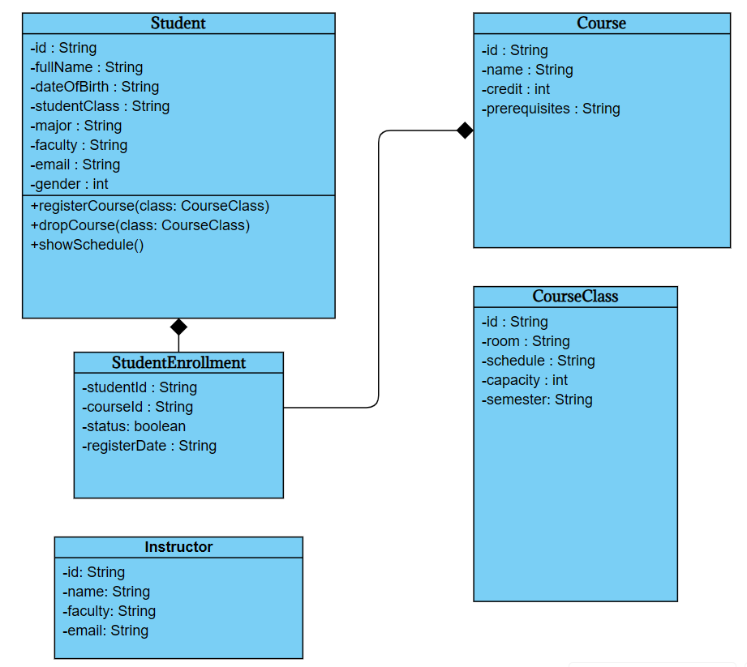

# Hệ thống đăng kí tín chỉ

[](https://github.com/HungNguyenBa1811/java-oop-ptit/blob/main/LICENSE)

# Description
Một dự án Java đơn giản để quản lý việc đăng kí tín chỉ của sinh viên, được xây dựng dựa trên cấu trúc MVC.

## Mục lục

- [Giới thiệu](#giới-thiệu)
- [Tính năng](#tính-năng)
- [Công nghệ sử dụng](#công-nghệ-sử-dụng)
- [Cấu trúc dự án](#cấu-trúc-dự-án)
- [Cài đặt](#cài-đặt)
- [Sử dụng](#sử-dụng)
- [Đóng góp & Phân công công việc](#đóng-góp--phân-công-công-việc)
- [Giấy phép](#giấy-phép)

## Giới thiệu

Đây là một dự án được phát triển nhằm mục đích học tập và thực hành các khái niệm về lập trình hướng đối tượng (OOP) trong Java, cũng như áp dụng mô hình kiến trúc Model-View-Controller (MVC). Hệ thống cho phép sinh viên đăng kí và quản lý các môn học của mình.

## Đối tượng làm việc
- Student
    + ID
    + Fullname
    + Date of birth
    + Student class
    + Major
    + Faculty
    + Student email
    + Gender
- Course information
    + ID
    + Course Name
    + Credit
    + Prerequisites
- Course class
    + ID
    + Room
    + Schedule
    + Capacity
    + Semester
- Student Enrollment
    + Student ID
    + Course ID
    + Status
    + Register Date
- Lecturer
    + ID
    + Name 
    + Faculty
    + Email

## Tính năng
- Quản lý danh sách sinh viên.
    + Thêm mới, chỉnh sửa, xóa thông tin sinh viên (họ tên, mã số sinh viên, ngày sinh, khoa/viện, khóa học, email, số điện thoại).
    + Tìm kiếm sinh viên theo mã số hoặc tên.
    + Xem chi tiết hồ sơ của từng sinh viên, bao gồm lịch sử đăng ký tín chỉ và trạng thái học tập.
    + Xuất danh sách sinh viên ra file (Excel/PDF) để phục vụ quản lý hoặc thống kê.
- Quản lý danh sách môn học.
    + Thêm mới, chỉnh sửa, xóa thông tin môn học (mã môn, tên môn, số tín chỉ, giảng viên phụ trách, số lượng tối đa sinh viên, thời gian và phòng học).
    + Tìm kiếm môn học theo tên hoặc mã môn.
    + Quản lý điều kiện tiên quyết (prerequisite) của từng môn.
    + Theo dõi tình trạng lớp học (còn chỗ, đã đầy, đã đóng đăng ký).
- Cho phép sinh viên đăng kí môn học.
    + Đăng nhập bằng tài khoản cá nhân để thực hiện đăng ký.
    + Chọn môn học từ danh sách hiển thị, kiểm tra điều kiện tiên quyết và số lượng chỗ còn lại.
    + Tự động kiểm tra xung đột lịch học (giờ, ngày) trước khi xác nhận đăng ký.
    + Hiển thị số tín chỉ đã đăng ký và tổng học phí dự kiến (nếu có).
    + Cung cấp thông báo xác nhận đăng ký thành công hoặc lỗi khi đăng ký.
- Hiển thị danh sách các môn đã đăng kí.
    + Hiển thị danh sách chi tiết các môn đã đăng ký kèm thông tin: mã môn, tên môn, số tín chỉ, thời gian, giảng viên, phòng học.
    + Cho phép hủy đăng ký môn học trong thời gian quy định.
    + Cung cấp tổng kết số tín chỉ hiện tại và trạng thái học phí (nếu có).
    + Xuất bảng đăng ký ra file (Excel/PDF) để lưu trữ hoặc in.


## Công nghệ sử dụng

- **Ngôn ngữ:** Java
- **Kiến trúc:** Model-View-Controller (MVC)
- **Cơ sở dữ liệu:** MySQL

## Cấu trúc dự án

Dự án được tổ chức theo mô hình MVC:

- **Model:** Chứa các lớp đại diện cho dữ liệu của ứng dụng (ví dụ: `SinhVien.java`, `MonHoc.java`) và logic nghiệp vụ, tương tác với cơ sở dữ liệu.
- **View:** Chịu trách nhiệm hiển thị dữ liệu cho người dùng (ví dụ: các lớp giao diện người dùng).
- **Controller:** Xử lý các yêu cầu từ người dùng, tương tác với `Model` và cập nhật `View`.

Class Diagram:
<div align="center">

</div>

Cấu trúc thư mục:
```
.
├── model
│   ├── SinhVien.java
│   └── MonHoc.java
├── view
│   └── AppView.java
├── controller
│   └── AppController.java
└── Main.java
```

Sơ đồ kiến trúc:
```ascii
+---------+         +-------------+         +------------------+
|  View   | <-----> |  Controller | <-----> |      Model       |
+---------+         +-------------+         +------------------+
    ^                     |                      |
    |                     v                      v
Người dùng          Xử lý logic           Database (MySQL)
```

## Cài đặt

1.  Clone repository về máy của bạn:
    ```sh
    git clone https://github.com/HungNguyenBa1811/java-oop-ptit.git
    ```
2.  Mở dự án bằng IDE yêu thích của bạn (ví dụ: IntelliJ, Eclipse).
3.  Biên dịch và chạy dự án.

## Sử dụng

Để chạy ứng dụng, bạn chỉ cần chạy file `Main.java`.

```java
public class Main {
    public static void main(String[] args) {
        // Khởi tạo và chạy ứng dụng
    }
}
```

## Đóng góp & Phân công công việc

| Thành Viên | Vai trò | Contact |
| :--- | :--- | :--- |
| Vũ Hoàng Anh | Leader + BE dev | anhvh189@gmail.com |
| Phan Nguyễn Việt Dũng | BE dev | phannguyenvietdung@gmail.com |
| Nguyễn Bá Hùng | FE dev + UI design | hungba1811@gmail.com |
| Lê Duy Anh | FE dev + UI design | duyanhle9c1@gmail.com |
| Nguyễn Trung Nam | Tester + BA | Trungnam0708qwert@gmail.com |

*Mọi người đều tham gia vào việc thiết kế cơ sở dữ liệu.*

## Giấy phép

Dự án này được cấp phép theo Giấy phép MIT. Xem file `LICENSE` để biết thêm chi tiết.
